# Fully customizable (FFF/FDM) 3D printer testing suite
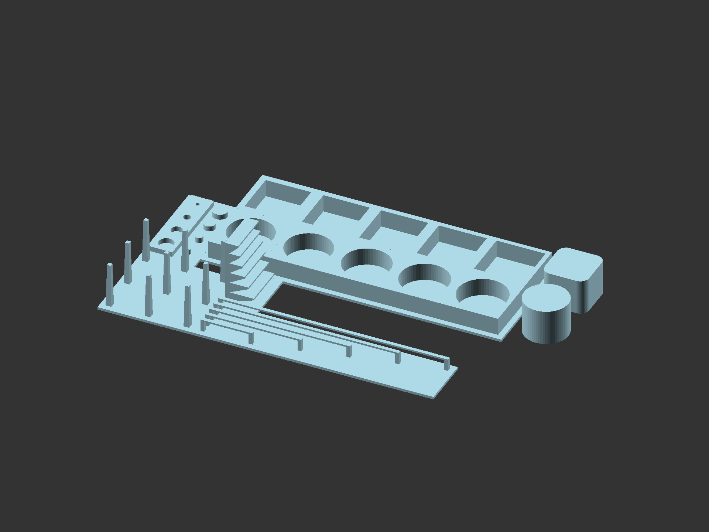
## Introduction
This is a fully customizable 3D printer testing suite including tests for stringing, tolerance, small features, bridging, overhangs, dimensional accuracy and radii.
Some of these tests focus more on machine capability while others are influenced more by filament choice.
**This testing suite is not a replacement for a proper calibration.** If you have not used your slicers builtin calibration tools, this is not for you.
**The tests included with this are not intended for tuning your printer. They will only show you where your print quality needs improvement, not tell you how to get there.**
That being said, I still hope you will find some use in it.
### Updates
I might make some changes to the code in the future and I might forget to update the makerworld page. If you want to make sure you are using the latest version, [visit my github repository here.](https://github.com/domi119017/3d-printer-testing-suite)
### Disclaimer
I did this to learn OpenSCAD and as such the quality of the code is rather bad. It does work, it just doesn't work well. There are some issues with step calculation in the tolerance aswell as the sphere test. If you see some missing features or borders which are too large, try tweaking the ranges until it works. *To be fair this isn't completely my fault as OpenSCAD doesn't allow the use of integers and does all calculations in floats.*
## Tests/settings
### Slicer settings
- layer height: copy from slicer
- extrusion width: copy from slicer
- slice gap closing radius: copy from slicer
### General settings
- bottom layers: Number of bottom layers to be generated under the test objects
- test padding: amount of extrusions between objects
- detail level: Number of arc segments, higher = smoother surfaces
- test type: Select a single test or generate all at once
### Packing
Packing is used if you want to generate some of the models but not all of them. If enabled it will overwrite the test type setting from general. Just check which tests you need.

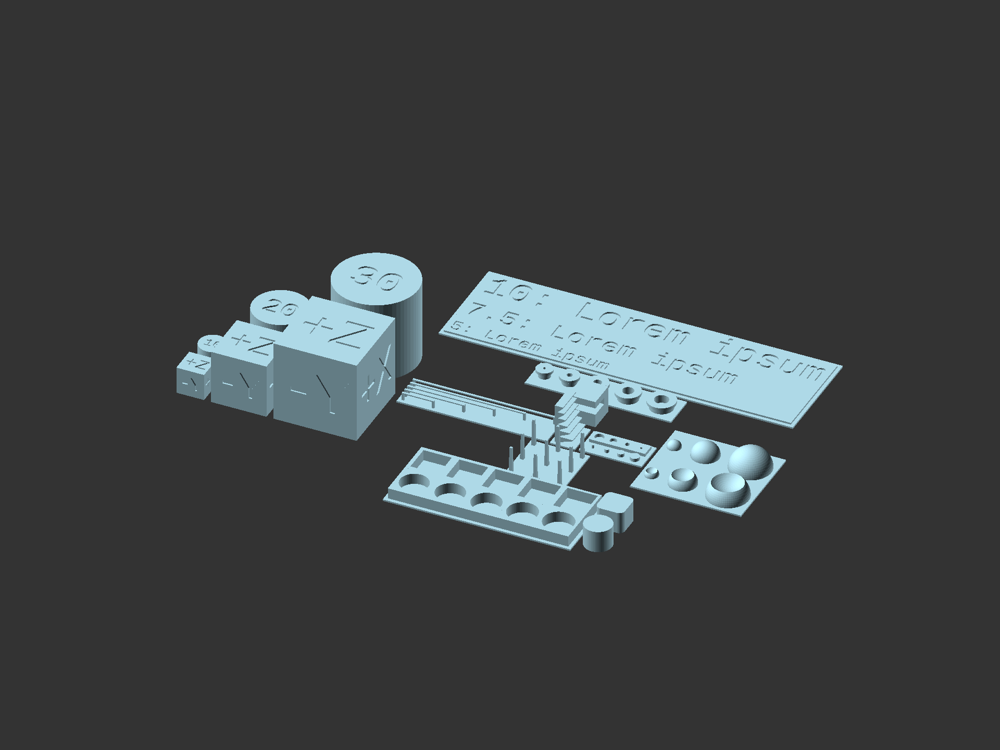
- pack objects: enable/disable
- packing rotation: Changes the order of directions in which objects are packed. Can be useful if something is packed inefficiently.
- sorting method: Changes order of objects while packing. Descending = largest object in the middle, ascending = smallest object in the middle.
### Stringing
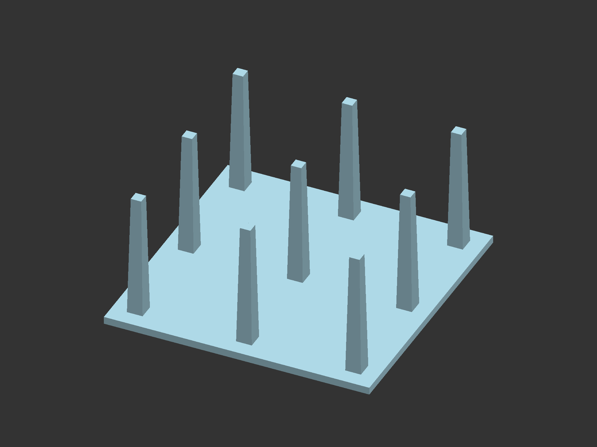

- tower count x: Number of towers in X direction
- tower count y: Number of towers in Y direction
- tower min dist: Minimum distance between towers (edge to edge)
- top extrusions: Number of extrusions at the top of the tower
- bottom extrusions: Number of extrusions at the bottom of the tower
- tower height: Height of the towers
### Overhang
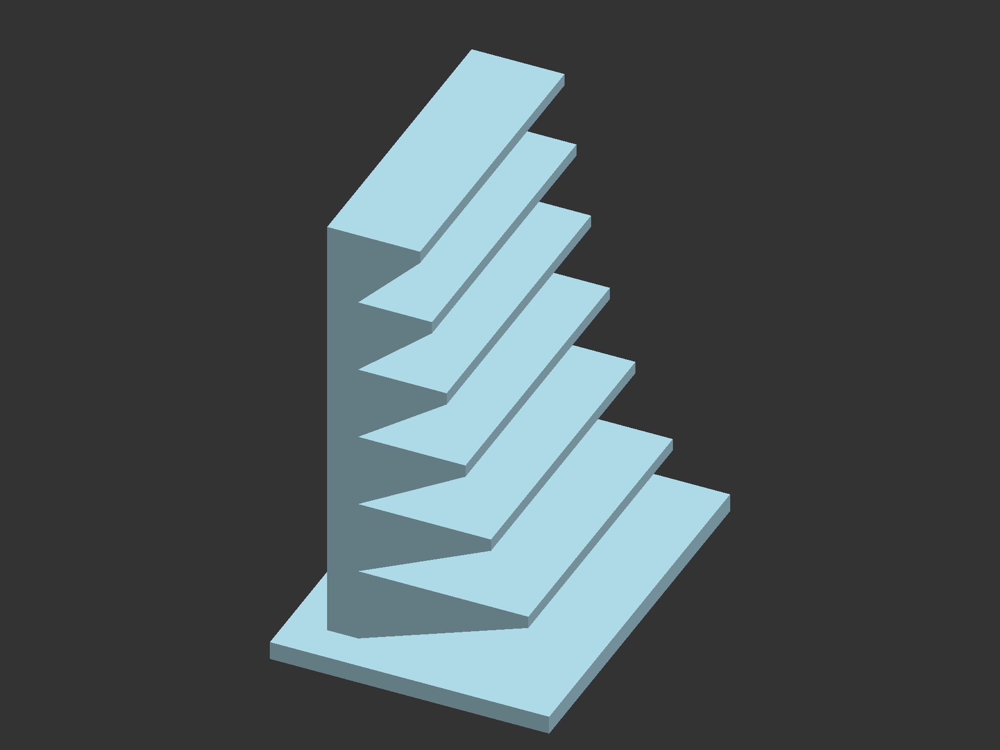

- start angle: Start angle of the overhang test
- end angle: End angle of the overhang test
- angle step: Angle step of the overhang test
- height: Height of the overhang test
- extra layers on top: Number of extra layers on top of the overhang test
- length: Length of the overhang test
### Peg/Hole
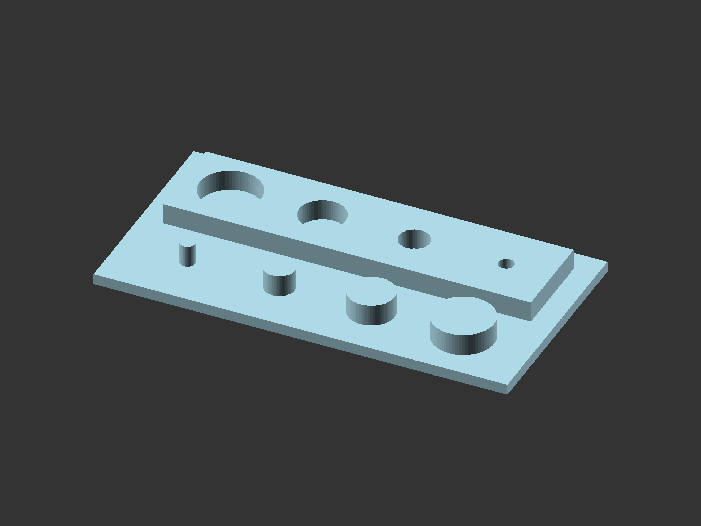

This test generates very small pegs and holes to test how well you are able to reproduce those features. You should be able to print a peg with diameter of 2 extrusions.
- min size: Minimum peg/hole size in extrusions
- max size: Maximum peg/hole size in extrusions
- step size: Peg size step in extrusions
- height: Height of the test
- min dist: Minimum distance between pegs/holes
### Bridging
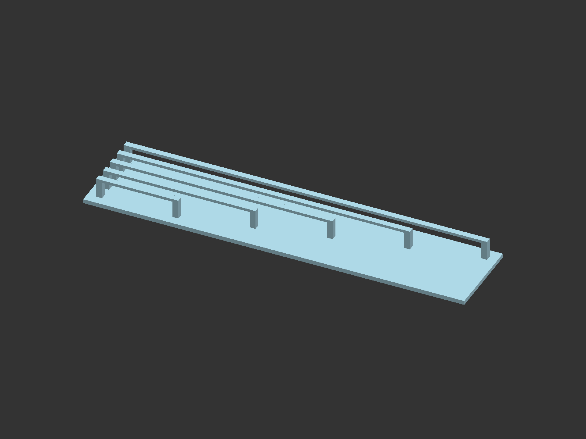

- start: Start length of the bridging test
- end: End length of the bridging test
- step: Length step of the bridging test
- tower height: Height of the test towers
- bridge height: Height of the bridges
- bridge width: Width of the bridges (I strongly recommend keeping this at 2, otherwise the slicer will generate top infill on the bridges)
- gap: Gap between the bridges (edge to edge)
### Tolerance
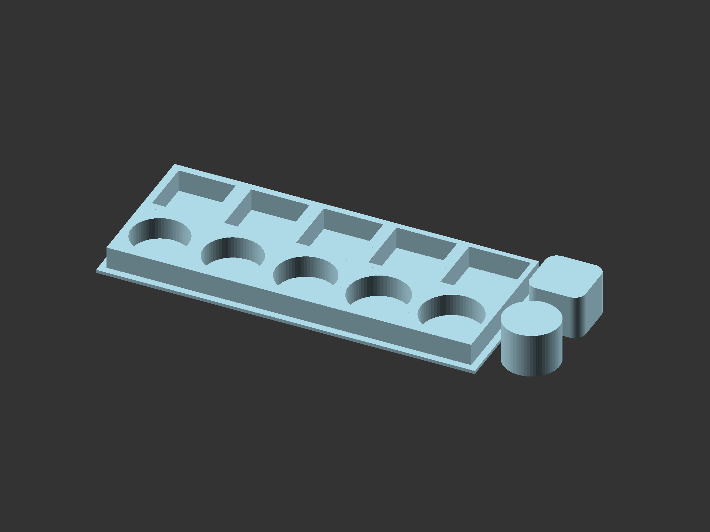

**If you encounter issues or warnings with this test, please read the disclaimer above.**
Note: with tolerance x the actual size of the hole will be 2x the tolerance. This is because the tolerance is applied to both sides of the hole.
- mode: Select between cube, cylinder or both
- start: Start tolerance
- end: End tolerance
- step: Tolerance step
- gap: Gap between the test objects
- diameter: Diameter of the test hole without tolerance
- height: Height of the test (Note: this only applies to the holes, the test cylinder&cube is always double the height)
### Sphere
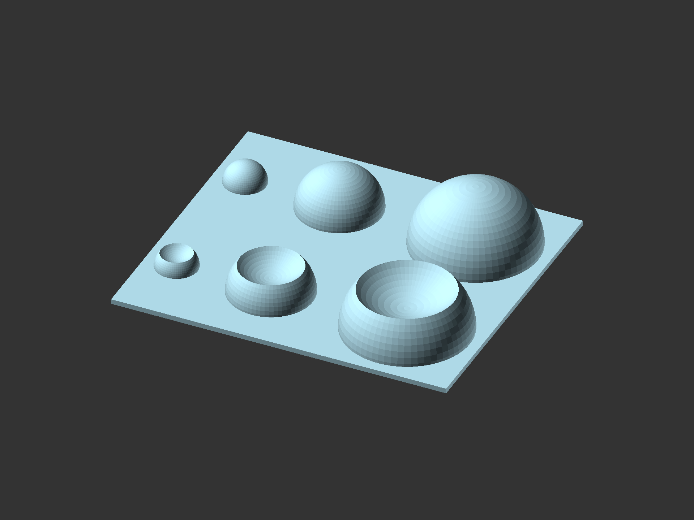

**If you encounter issues or warnings with this test, please read the disclaimer above.**
The necessity of this test is debatable, but it can be useful to tune adaptive layer height quality settings and as 3D printers in general struggle with spheres.
- mode: Select between bowl, sphere or both
- start: Start size
- end: End size
- step: Size step
- gap: Gap between the test objects
### Dimensional accuracy
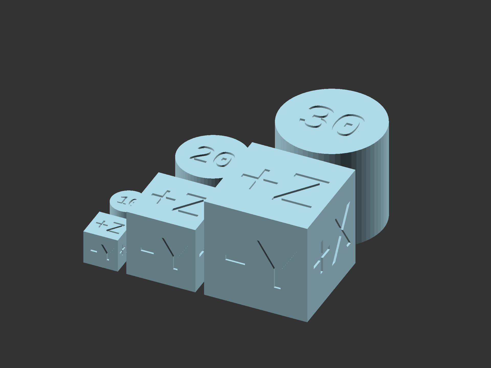

**Please do not use this test to tune your steps/mm. This is only intended to verify dimensional accuracy. To calibrate your steps/mm I recommend the [cauliflower calibration](https://www.printables.com/model/682023-califlower-calibration-stl-calculator) by @AdamVector3D**
- mode: Select between cube, cylinder or both
- start: Start size
- end: End size
- step: Size step
- gap: Gap between the test objects
- text depth: Depth of the text on the test objects
### Text size test
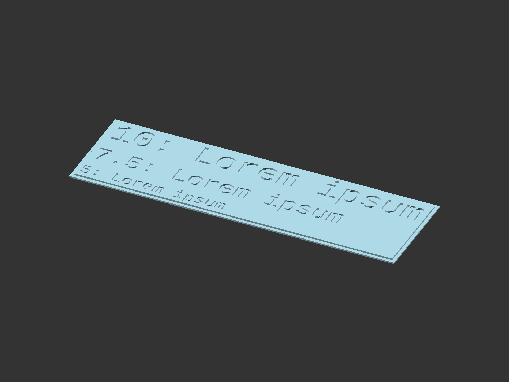
Can be used to test at which size text is too small to be legible.
- ts string: Text to be displayed
- ts start: Start size
- ts end: End size
- ts step: Size step
- ts depth: Depth of the text
- ts min dist: Minimum distance between text
#### Advanced settings
- ts adv scaling factor view: Enable to adjust scaling factor
- ts adv font: Font to be used
- ts adv width scaling: Width scaling factor
- ts adv height scaling: Height scaling factor (You should not need to change this)
#### Text width scaling factor
If you change the font, you will need to adjust the width scaling factor using the scaling factor view until the box has equal spacing around the text.
- This is too small: 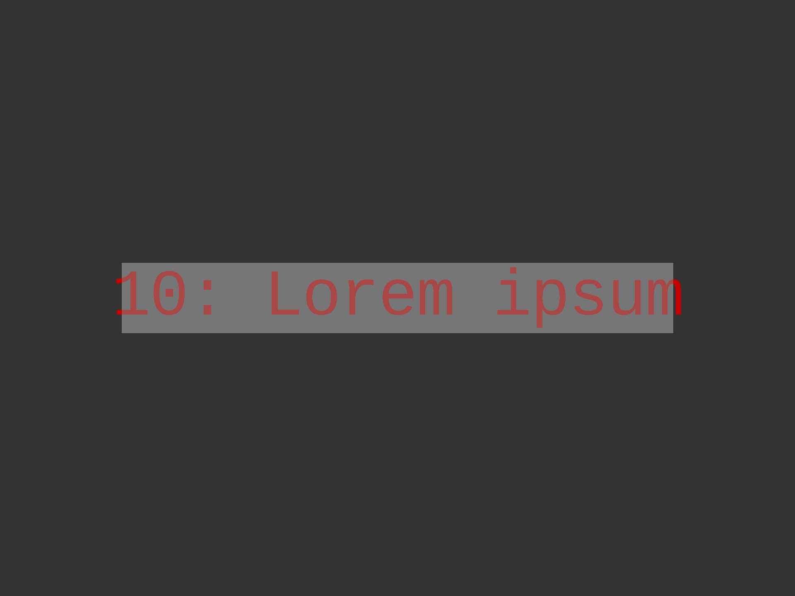
- This is too large: 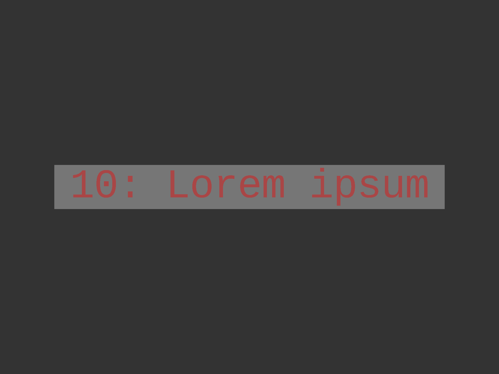
- This is correct: 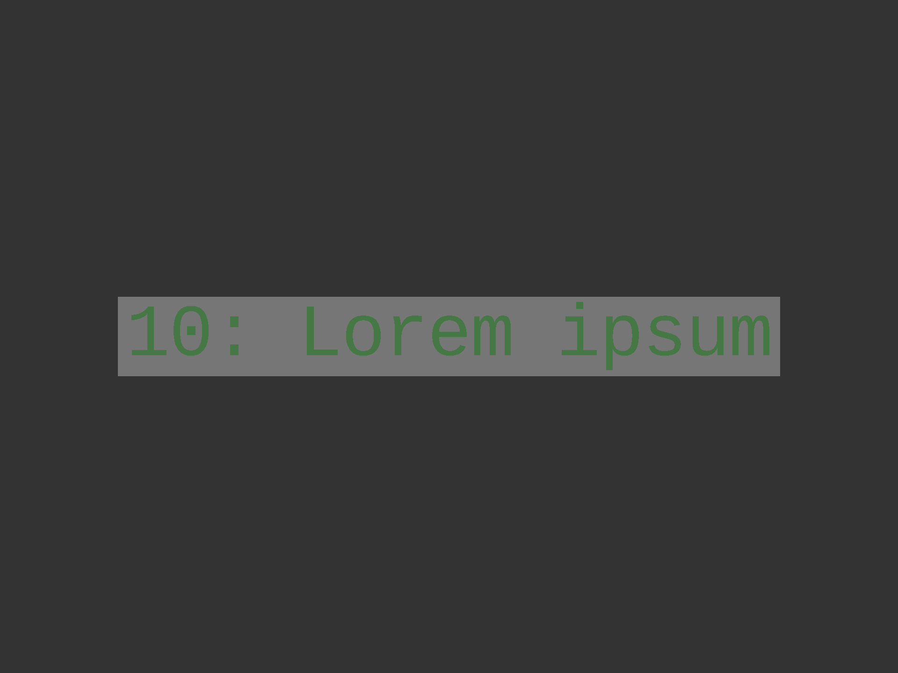

### Chimney test
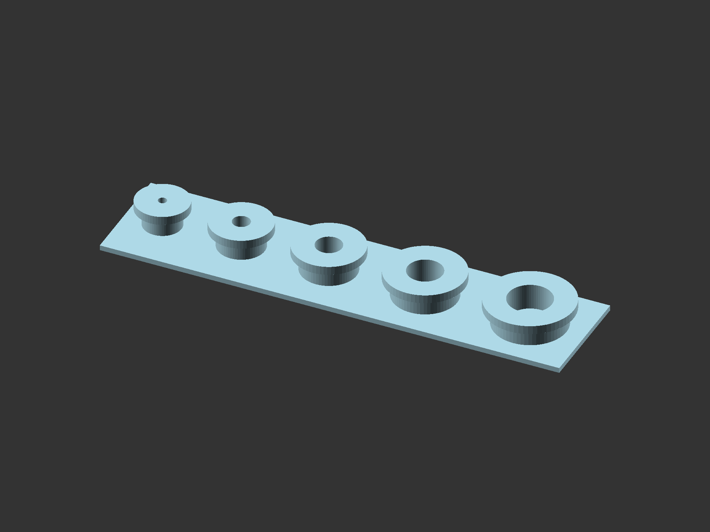
- chimney base height: Height of the base in layers
- chimney top height: Height of the top part in layers
- chimney base wall thickness: Wall thickness of the base in extrusions
- chimney top extra thickness: Extra wall thickness of the top part in extrusions (This is the amount of overhanging walls)
- chimney hole start diameter: Start diameter of the hole (mm)
- chimney hole end diameter: End diameter of the hole (mm)
- chimney hole diameter step: Diameter step of the hole (mm)

### Support test
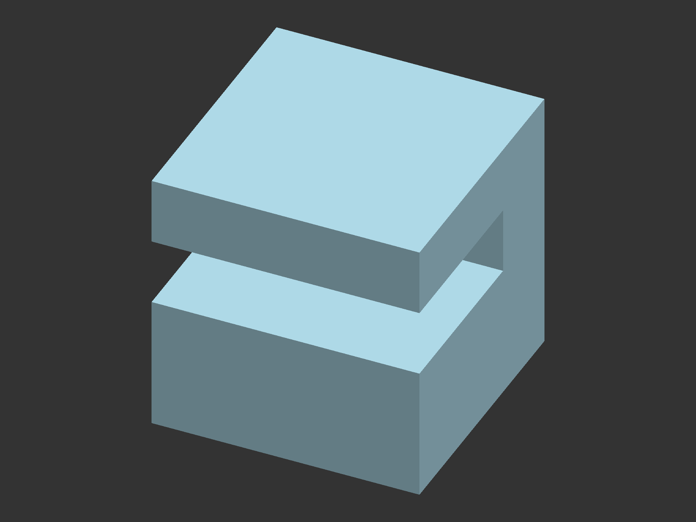
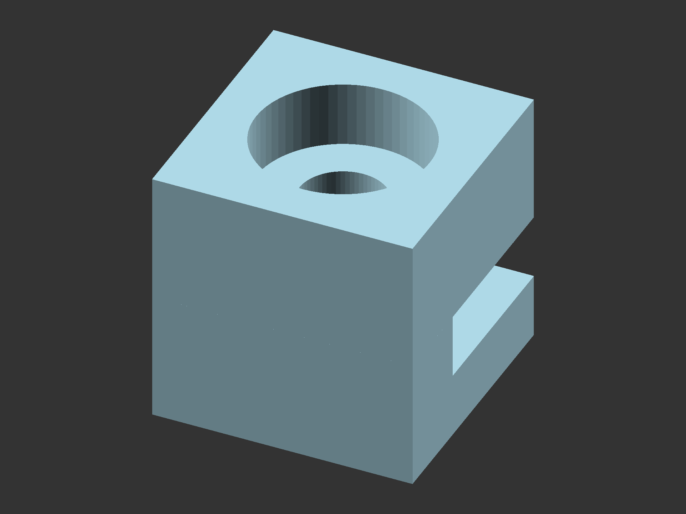

Basic test object with adjustable size for testing support and support interface quality.
- support cube size: Size of the base in mm
- support cube height: Height of the cube in mm

### Bed leveling
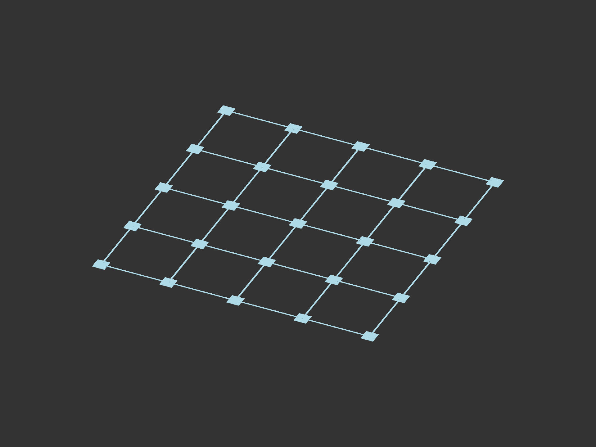
Used to test if your bed is level.
- bed size x: Bed size in X direction
- bed size y: Bed size in Y direction
- bed level test mode: Select between spot, line or both
- bed level spot size: Size of the spots
- bed level line width: Width of the lines in extrusions
- bed level padding: Padding to the edge of the bed
- bed level divisions: Number of spots/lines

## Contributing
If you have any suggestions or improvements, feel free to open an issue or a pull request on the github repository or send me a message on makerworld.